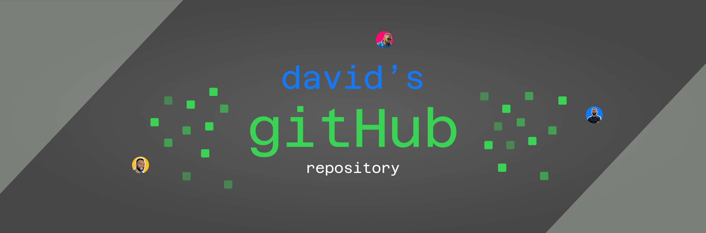

<!--  -->

 
Hey there 🙋‍♂️,

I'm David, a freelance front-end engineer, uxui designer and music enthusiast who specializes in front-end development. I am a life long learner and a deeply curious mind

Want to know more about me? [Check out my portfolio](https://www.davidwebworks.com){:target='\_blank'}

 

## What I'm up to:

- 🔭 I’m currently working as a **freelance developer**

- 🌱 I’m currently learning **React target='\_blank'**

- 👯 I’m looking to collaborate on **challenging projects**

- 💬 Ask me about **Javascript, React, Tailwind**

- 📫 How to reach me **adewaledavidola@gmail.com**

- ⚡ Fun fact **I love to design, code and make music 🎵**

## 📌 My recent projects

- <a href='https://www.getdronic.com' target='_blank'>Dronic Smart Plugs</a> : I helped bring Dronic Smart Plugs' vision to life with a sleek logo, vibrant colors, and an easy-to-use online shop.
   
- <a href='https://travelxpressng.netlify.app/' target='_blank'>TravelXpressNg</a> : I am currently working on the website for TravelXpressNg - a travel company in Nigeria.

 
 

## 💼 Skills

🎶 <em>If you are curious, you can checkout my music <a href='https://audiomack.com/realmace' target='_blank'>here</a></em> 🎧
