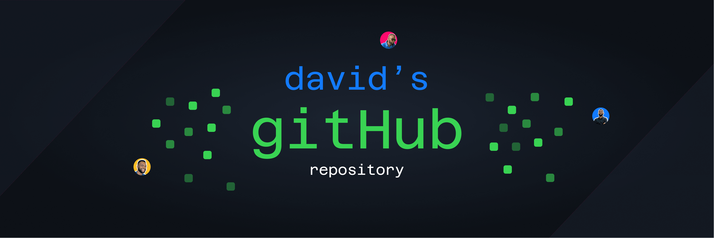

 
Hey there 🙋‍♂️,

I'm David, a freelance front-end engineer, uxui designer and music enthusiast who specializes in front-end development. I am a life long learner and a deeply curious mind

Want to know more about me? <a href='https://www.davidwebworks.com'> Check out my portfolio</a>

 

<h2>What I'm up to:</h2>

- 🔭 I’m currently working as a **freelance developer**

- 🌱 I’m currently learning **React Redux**

- 👯 I’m looking to collaborate on **challenging projects**

- 💬 Ask me about **Javascript, React, Tailwind**

- 📫 How to reach me **adewaledavidola@gmail.com**

- ⚡ Fun fact **I love to design, code and make music 🎵**

<h3 align="left">Connect with me:</h3>

<h3 align="left">Languages and Tools:</h3>

          

